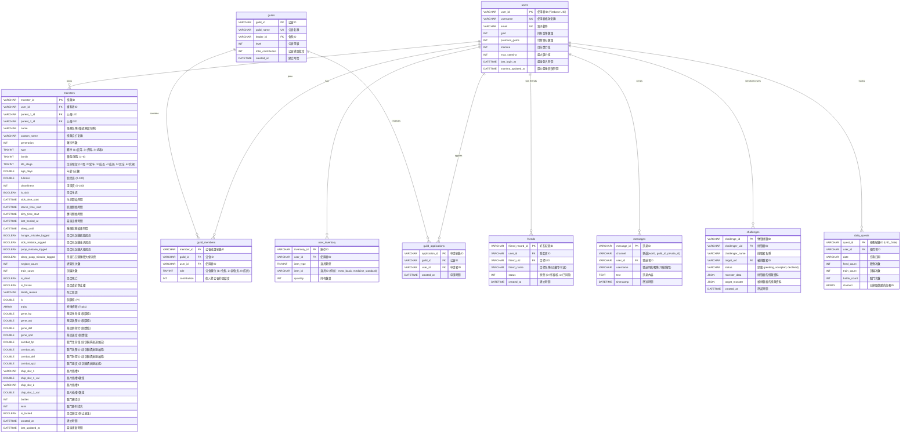

# 五、 技術規格與資料庫 Schema 設計 (Database Design)

為了實現註冊、多隻怪獸儲存、以及即時互動，後端必須使用高可用性的關係型資料庫，並設定嚴謹的主鍵/外鍵關聯。

## 5.1 關聯架構圖

### 概念關聯圖 (ERD Concept)
```
[Users Table] (1) <─────── (N) [Monsters Table] (1) <─── (N) [Breeding Records Table]
      │                                                           │
      ├─────── (N) [Guild Members] (N) ───────> [Guilds Table] (1) ┘
      │
      └─────── (N) [User Inventory Table]
```

### 詳細實體關係圖 (Entity Relationship Diagram)


## 5.2 核心資料表 (Database Tables)

*參考原有系統需求書內容建立，主要包含 `users`, `monsters`, `user_inventory`, `guilds`, `friends` 結構。*

## 5.3 遊戲邏輯與 UI 顯示規格

### 1. 怪獸進化條件與圖鑑顯示
圖鑑介面中，每一隻怪獸除了顯示屬性與外觀，皆需附帶該階段至下一階段的「進化條件說明」，並在養成面板 (Dashboard) 即時顯示當下的**培育參數**（包含：培育失誤次數、訓練次數、戰鬥勝率），以利玩家隨時掌握進化路線。

* **幼年期**：孵化後即進入幼年期。
* **成長期**：12小時後隨機進化。
* **成熟期** (48小時後)：
  * 疫苗種：訓練≥15次，培育失誤≤2次。
  * 資料種：訓練≥5次，培育失誤≤5次。
  * 病毒種：未達上述條件。
* **完全體** (96小時後)：
  * 疫苗種：戰鬥≥30場，勝率≥60%，培育失誤≤3次。
  * 資料種：戰鬥≥15場，勝率≥40%，培育失誤≤6次。
  * 病毒種：未達上述條件。
* **究極體** (7天後)：
  * 需達成 50 戰與 70% 勝率，並消耗道具「究極進化核心」。

### 2. 系統字串中文化對照
凡是 API 回傳或介面顯示的道具 ID 或數值欄位，均必須轉換為在地化中文，避免讓玩家看到生硬的系統變數名稱：
* `chip_spd` -> `速度晶片`，對應數值 `combat_spd` -> `戰鬥速度`
* `chip_atk` -> `攻擊晶片`，對應數值 `combat_atk` -> `戰鬥攻擊`
* `chip_def` -> `防禦晶片`，對應數值 `combat_def` -> `戰鬥防禦`
* `chip_hp`  -> `生命晶片`，對應數值 `combat_hp`  -> `戰鬥生命`
* `meat_basic` -> `普通肉塊`
* `medicine_standard` -> `標準特效藥`
* 等等...
